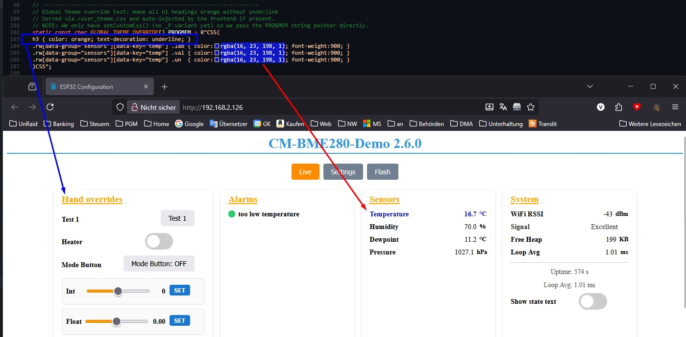

# ConfigurationsManager for ESP32

> Version 2.7.0 (2025.11.01)

> Breaking changes in v2.7.x
>
> - Introduced modular architecture with separate WiFi, Web, OTA, and Runtime managers
> - Added integrated Smart WiFi Roaming feature for automatic access point switching
> - Some APIs have been moved into dedicated manager classes (use `getWiFiManager()`, `getWebManager()`, etc.)
> - If you are upgrading from < 2.7, check your code for WiFi management calls and update accordingly

## Overview

ConfigurationsManager is a C++17 helper library + example firmware for managing persistent configuration values on ESP32 (NVS / Preferences) and exposing them via a responsive Vue 3 single‑page web UI (settings + live runtime dashboard + OTA flashing). It focuses on:

- Type‑safe templated `Config<T>` wrappers
- Central registration + bulk load/save functions
- Optional pretty display names and pretty category names (decouple storage key from UI)
- Automatic key truncation safety (category + key <= 15 chars total in NVS) with friendly UI name preserved
  -- Dynamic conditional visibility (`showIf` lambdas)
- Callbacks on value change
- OTA update integration
- Static or DHCP WiFi startup helpers (multiple overloads)

## Note: This is a C++17 Project

> Requires `-std=gnu++17` (or newer) in `platformio.ini` or Arduino IDE settings. The library uses C++17 features like inline variables, structured bindings, lambdas with captures in unevaluated contexts, and `std::function` for callbacks.

## Features

- 📦 Non-Volatile Storage (NVS) integration (ESP Preferences)
- 🎯 Declarative config registration with a `ConfigOptions<T>` aggregate
- 🌐 responsive web configuration interface (embedded in flash)
- 🚀 OTA firmware upload endpoint
- ⚡ Flash firmware directly from the web UI (password-protected HTTP OTA)
- 🪄 Dynamic visibility of settings via `showIf` lambda (e.g. hide static IP fields while DHCP enabled)
- 🔒 Password masking & selective exposure
- 🎨 Live-Values - two theming paths: per‑field JSON style metadata or global `/user_theme.css` override
- 🛎️ Per‑setting callbacks (`cb` or `setCallback`) on value changes
- 📡 AP Mode fallback / captive portal style entry
- � **Smart WiFi Roaming** - Automatic switching to stronger access points in mesh networks
- �🔴 Live runtime values (`/runtime.json`) (you can make your own Web-Interface by design the Vue 3 embedded Project)
- Manager API: `addRuntimeProvider({...})`, `enableWebSocketPush(intervalMs)`, `pushRuntimeNow()`, optional `setCustomLivePayloadBuilder()`
- 🧩 Boilerplate reduction helpers: `OptionGroup` factory + `showIfTrue()/showIfFalse()` visibility helpers (since 2.4.3)

## Documentation Index

| Topic                                     | File                    |
| ----------------------------------------- | ----------------------- |
| Settings & OptionGroup                    | `docs/SETTINGS.md`      |
| Runtime Providers & Alarms                | `docs/RUNTIME.md`       |
| Smart WiFi Roaming                        | `docs/SMART_ROAMING.md` |
| Styling (per-field metadata)              | `docs/STYLING.md`       |
| Theming (global CSS + disabling metadata) | `docs/THEMING.md`       |
| Feature Flags (compile-time switches)     | `docs/FEATURE_FLAGS.md` |

## Requirements

- Compatible development board (ESP32 development board)
- PlatformIO (preferred) or Arduino IDE (Arduino IDE not tested!)
- Add `-std=gnu++17` (and remove default gnu++11) in `platformio.ini`

## Installation

```bash
# PlatformIO
pio pkg install --library "vitaly.ruhl/ESP32ConfigManager"
```

## Setup Requirements

### PlatformIO Configuration

When setting up your `platformio.ini`, ensure you include these **required** settings:

- `build_unflags = -std=gnu++11` → **Required** to deactivate the old default C++ standard
- `-Wno-deprecated-declarations` → **Required** to suppress deprecated warnings from ArduinoJson
- `-std=gnu++17` → **Required** to enable C++17 features
- `extra_scripts = pre:tools/precompile_wrapper.py` → **Required** to build and inject the web UI automatically

> **Important**: Copy `tools/precompile_wrapper.py` from the `/examples` folder to your project and use it instead of the library's internal script to reduce flash usage!

### Dependencies

Before using the precompile wrapper script, ensure you have the following installed:

**Python Dependencies:**

1. **Python 3.7+** - Make sure you have Python 3.7 or newer installed
2. **Required Python packages**: Install with `pip install intelhex`

**Node.js Dependencies:**

- **Node.js 16+** (includes npm) - The precompile script builds a Vue.js web interface

**Automated Setup:**
You can use the `setup_dependencies.py` script in the tools folder to install all dependencies automatically.

## Examples

> Example files live in the `examples/` directory:

Only v2.7.x examples are kept:

- `main.cpp_example_min` – Minimal WiFi + runtime provider + WebSocket push + OTA.
- [BME280 Example light](examples/bme280/main.cpp_bme280)
- [Full featured demo with all UI controls + BME280 sensor + runtime + alarms + OTA](examples/BME280-Full-GUI-Demo/main.cpp_BME280-Full-GUI-Demo)


### To see how I use it in my projects

- [https://github.com/vitalyruhl/SolarInverterLimiter](https://github.com/vitalyruhl/SolarInverterLimiter)
- [https://github.com/vitalyruhl/BoilerSaver](https://github.com/vitalyruhl/BoilerSaver)


### minimal pattern (using `ESPAsyncWebServer`)

```cpp
#include <Arduino.h>
#include <AsyncTCP.h>
#include <ESPAsyncWebServer.h>
#include "ConfigManager.h"
AsyncWebServer server(80);

#define VERSION "V2.6.1" // 2025.10.08
#define APP_NAME "CM-Min-Demo"

ConfigManagerClass cfg;                                               // Create an instance of ConfigManager before using it in structures etc.
ConfigManagerClass::LogCallback ConfigManagerClass::logger = nullptr; // Initialize the logger to nullptr

// Basic setting using new aggregate initialization (ConfigOptions<T>)
Config<int> updateInterval(ConfigOptions<int>{
    .key = "interval",
    .name = "Update Interval (seconds)",
    .category = "main",
    .defaultValue = 30});

// Example of a structure for WiFi settings
struct WiFi_Settings // wifiSettings
{
    Config<String> wifiSsid;
    Config<String> wifiPassword;
    Config<bool> useDhcp;
    Config<String> staticIp;
    Config<String> gateway;
    Config<String> subnet;

    // Shared OptionGroup constants to avoid repetition
    static constexpr OptionGroup WIFI_GROUP{"wifi", "WiFi Settings"};

    WiFi_Settings() : // Use OptionGroup helpers with shared constexpr instances
                      wifiSsid(WIFI_GROUP.opt<String>("ssid", "MyWiFi", "WiFi SSID")),
                      wifiPassword(WIFI_GROUP.opt<String>("password", "secretpass", "WiFi Password", true, true)),
                      useDhcp(WIFI_GROUP.opt<bool>("dhcp", false, "Use DHCP")),
                      staticIp(WIFI_GROUP.opt<String>("sIP", "192.168.2.126", "Static IP", true, false, nullptr, showIfFalse(useDhcp))),
                      gateway(WIFI_GROUP.opt<String>("GW", "192.168.2.250", "Gateway", true, false, nullptr, showIfFalse(useDhcp))),
                      subnet(WIFI_GROUP.opt<String>("subnet", "255.255.255.0", "Subnet-Mask", true, false, nullptr, showIfFalse(useDhcp)))
    {
        // Register settings with ConfigManager
        cfg.addSetting(&wifiSsid);
        cfg.addSetting(&wifiPassword);
        cfg.addSetting(&useDhcp);
        cfg.addSetting(&staticIp);
        cfg.addSetting(&gateway);
        cfg.addSetting(&subnet);
    }
};

WiFi_Settings wifiSettings; // Create an instance of WiFi_Settings-Struct

void setup()
{
    Serial.begin(115200);
    ConfigManagerClass::setLogger([](const char *msg)
                                  { Serial.print("[CFG] "); Serial.println(msg); });

    cfg.setAppName(APP_NAME); // Set an application name, used for SSID in AP mode and as a prefix for the hostname

    cfg.addSetting(&updateInterval);
    cfg.checkSettingsForErrors();

    try
    {
        cfg.loadAll(); // Load all settings from preferences, is nessesary before using the settings!
    }
    catch (const std::exception &e)
    {
        Serial.println(e.what());
    }

    Serial.println("Loaded configuration:");
    delay(300);

    // print loaded settings to Serial (optional)
    Serial.println("Configuration printout:");
    Serial.println(cfg.toJSON(false));

    // Example set a Value from Program
    updateInterval.set(15);
    cfg.saveAll();

    // nesseasary settings for webserver and wifi
    if (wifiSettings.wifiSsid.get().length() == 0)
    {
        Serial.printf("⚠️ SETUP: SSID is empty! [%s]\n", wifiSettings.wifiSsid.get().c_str());
        cfg.startAccessPoint();
    }

    if (WiFi.getMode() == WIFI_AP)
    {
        Serial.printf("🖥️  AP Mode! \n");
        return; // Skip webserver setup in AP mode
    }

        // Enable built-in System provider (RSSI, freeHeap, optional loop avg) before starting the web server
        // Requires CM_ENABLE_SYSTEM_PROVIDER=1 at compile time
        cfg.enableBuiltinSystemProvider();

    if (wifiSettings.useDhcp.get())
    {
        Serial.println("DHCP enabled");
        cfg.startWebServer(wifiSettings.wifiSsid.get(), wifiSettings.wifiPassword.get());
    }
    else
    {
        Serial.println("DHCP disabled");
        cfg.startWebServer(wifiSettings.staticIp.get(), wifiSettings.gateway.get(), wifiSettings.subnet.get(), wifiSettings.wifiSsid.get(), wifiSettings.wifiPassword.get());
    }

    delay(1500);                    // wait for wifi connection a bit
    cfg.enableWebSocketPush(2000); // 2s Interval for push updates to clients - if not set, ui will use polling

    if (WiFi.status() == WL_CONNECTED)
    {
        // OTA setup (always call if feature compiled in & user enabled; handleOTA will defer until WiFi is up)
        cfg.setupOTA("esp32", "otapassword123");
    }
    Serial.printf("🖥️ Webserver running at: %s\n", WiFi.localIP().toString().c_str());
}

void loop()
{
    //nessesary for webserver and wifi to handle clients and websocket
    cfg.handleClient();
    cfg.handleWebsocketPush();
    cfg.handleOTA();
    cfg.updateLoopTiming();// Update rolling loop timing window so the system provider can expose avg loop time if desired and show the SystemProvider Information

    //reconnect if wifi is lost
    if (WiFi.status() != WL_CONNECTED && WiFi.getMode() != WIFI_AP)
    {
        Serial.println("⚠️ WiFi lost, reconnecting...");
        cfg.reconnectWifi();
        delay(1500); // wait for wifi connection a bit
        cfg.setupOTA("esp32", "otapassword123");
    }


> Breaking changes in v2.7.x
>
> - Introduced modular architecture with separate WiFi, Web, OTA, and Runtime managers
> - Added integrated Smart WiFi Roaming feature for automatic access point switching
> - Some APIs have been moved into dedicated manager classes (use `getWiFiManager()`, `getWebManager()`, etc.)
> - ConfigOptions field rename: `keyName` → `key`, `prettyName` → `name`, `prettyCat` → `categoryPretty`
> - If you are upgrading from < 2.7, check your code for WiFi management calls and update accordingly
    delay(updateInterval.get());
- **FRITZ!Box Mesh networks** with multiple repeaters
- **Enterprise WiFi** with multiple access points
- **Home mesh systems** where devices get "stuck" to distant APs

### How Smart Roaming Works

1. **Signal Monitoring**: Continuously monitors WiFi signal strength (RSSI)

    // Configure Smart WiFi Roaming (optional - defaults work well)
    ConfigManager.enableSmartRoaming(true);        // Enable/disable (default: true)
    ConfigManager.setRoamingImprovement(10);       // Minimum signal improvement required in dBm (default: 10)

    // ... continue with WiFi setup ...
}
```

### Default Settings

| Parameter       | Default Value | Description                                        |
| --------------- | ------------- | -------------------------------------------------- |
| **Enabled**     | `true`        | Smart roaming is active by default                 |
| **Threshold**   | `-75 dBm`     | Trigger roaming when signal is weaker than -75 dBm |
| **Cooldown**    | `120 seconds` | Wait 2 minutes between roaming attempts            |
| **Improvement** | `10 dBm`      | Only switch if new AP is 10+ dBm stronger          |

When Smart Roaming is active, you'll see logs like:

```
[ConfigManager] [WiFi] Smart Roaming enabled
[ConfigManager] [WiFi] Roaming threshold set to -75 dBm
[ConfigManager] [WiFi] Current RSSI (-92 dBm) below threshold (-75 dBm), scanning for better APs...
[ConfigManager] [WiFi] Found better AP: 60:B5:8D:4C:E1:D5 (RSSI: -45 dBm, improvement: 47 dBm)
[ConfigManager] [WiFi] Initiated roaming to better access point
```

### Advanced Usage

For complete control over the WiFi manager:

```cpp
// Check if roaming is enabled
if (wifiMgr.isSmartRoamingEnabled()) {
    Serial.println("Smart roaming is active");
}

// Disable roaming temporarily
wifiMgr.enableSmartRoaming(false);

```

### PlatformIO Environment Examples

```ini
[env:usb]
platform = espressif32
board = nodemcu-32s
framework = arduino
upload_port = COM[5]
monitor_speed = 115200
;build_unflags = -std=gnu++11 ;required, to deactivate old default
build_unflags = -std=gnu++11
build_flags =
	-DUNIT_TEST
	-Wno-deprecated-declarations
	-std=gnu++17
	-DCM_EMBED_WEBUI=1
	-DCM_ENABLE_WS_PUSH=1
	-DCM_ENABLE_SYSTEM_PROVIDER=1
	-DCM_ENABLE_OTA=1
	-DCM_ENABLE_RUNTIME_BUTTONS=1
	-DCM_ENABLE_RUNTIME_CHECKBOXES=1
	-DCM_ENABLE_RUNTIME_STATE_BUTTONS=1
	-DCM_ENABLE_RUNTIME_ANALOG_SLIDERS=1
	-DCM_ENABLE_RUNTIME_ALARMS=1
	-DCM_ENABLE_RUNTIME_NUMBER_INPUTS=1
	-DCM_ENABLE_STYLE_RULES=1
	-DCM_ENABLE_USER_CSS=1
	-DCM_ENABLE_LOGGING=1
	-DCM_ENABLE_VERBOSE_LOGGING=0
	-DCONFIG_BOOTLOADER_WDT_DISABLE_IN_USER_CODE=1
	-DCONFIG_ESP32_BROWNOUT_DET_LVL0=1

lib_deps =
	bblanchon/ArduinoJson@^7.4.1
	esphome/ESPAsyncWebServer-esphome@^3.2.2
	esphome/AsyncTCP-esphome@^2.0.3
	ks-tec/BME280_I2C@1.4.1+002
	knolleary/PubSubClient@^2.8
	adafruit/Adafruit GFX Library@^1.12.1
test_ignore = src/main.cpp
extra_scripts = pre:tools/precompile_wrapper.py

;use this in Your own projects to have a precompile script
;copy the tools/precompile_wrapper.py to your project
;extra_scripts = pre:tools/precompile_wrapper.py


[env:ota]
platform = espressif32
board = nodemcu-32s
framework = arduino
monitor_speed = 115200
;build_unflags = -std=gnu++11 ;required, to deactivate old default
build_unflags = -std=gnu++11
build_flags =
	-DUNIT_TEST
	-Wno-deprecated-declarations
	-std=gnu++17
	-DCM_EMBED_WEBUI=1
	-DCM_ENABLE_WS_PUSH=1
	-DCM_ENABLE_SYSTEM_PROVIDER=1
	-DCM_ENABLE_OTA=1
	-DCM_ENABLE_RUNTIME_BUTTONS=1
	-DCM_ENABLE_RUNTIME_CHECKBOXES=1
	-DCM_ENABLE_RUNTIME_STATE_BUTTONS=1
	-DCM_ENABLE_RUNTIME_ANALOG_SLIDERS=1
	-DCM_ENABLE_RUNTIME_ALARMS=1
	-DCM_ENABLE_RUNTIME_NUMBER_INPUTS=1
	-DCM_ENABLE_STYLE_RULES=1
	-DCM_ENABLE_USER_CSS=1
	-DCM_ENABLE_LOGGING=1
	-DCM_ENABLE_VERBOSE_LOGGING=0
	-DCONFIG_BOOTLOADER_WDT_DISABLE_IN_USER_CODE=1
	-DCONFIG_ESP32_BROWNOUT_DET_LVL0=1
	-DCONFIG_BOOTLOADER_WDT_DISABLE_IN_USER_CODE=1
	-DCONFIG_ESP32_BROWNOUT_DET_LVL0=1
lib_deps =
	bblanchon/ArduinoJson@^7.4.1
	esphome/ESPAsyncWebServer-esphome@^3.2.2
	esphome/AsyncTCP-esphome@^2.0.3
	ks-tec/BME280_I2C@1.4.1+002
	knolleary/PubSubClient@^2.8
	adafruit/Adafruit GFX Library@^1.12.1
test_ignore = src/main.cpp

;;test-esp
upload_port = 192.168.2.126
upload_flags = --auth=ota

extra_scripts = pre:tools/precompile_wrapper.py
```

## Flash Firmware via Web UI

The embedded single-page app now exposes a `Flash` action beside the `Settings` tab so you can push new firmware without leaving the browser.

1. Enable `Allow OTA Updates` under **System** and set an `OTA Password` (leave empty to allow unauthenticated uploads).
2. Click **Flash** and pick the compiled `.bin` (or `.bin.gz`) image produced by PlatformIO / Arduino.
3. Enter the OTA password when prompted. The SPA sends it as the `X-OTA-PASSWORD` header so it never ends up inside the firmware payload.
4. Watch the toast notifications for progress. On success the device reboots automatically; the UI keeps polling until it comes back online.

The backend remains fully asynchronous (`ESPAsyncWebServer`)—the new `/ota_update` handler streams chunks into the `Update` API while still performing password checks. HTTP uploads are rejected when OTA is disabled, the password is missing/incorrect, or the upload fails integrity checks.

Note: The runtime JSON includes system-level OTA flags used by the WebUI to enable the Flash button and show status. Specifically, `runtime.system.allowOTA` is true when OTA is enabled on the device (HTTP endpoint ready), and `runtime.system.otaActive` is true after `ArduinoOTA.begin()` has run (informational). Both are available only when compiled with `-DCM_ENABLE_OTA=1`.

### Async Build & Live Values

The project now always uses the Async stack; no `env:async` or `-DUSE_ASYNC_WEBSERVER` define is needed.

If the WebSocket isn't connected the frontend transparently polls `/runtime.json`.

### PlatformIO environments (usb / ota / publish)

```sh
#See platformio.ini for details

pio run -e usb -t upload # upload via usb

# Or via ota:
pio run -e ota -t upload

#or:
#pio run --target upload --upload-port <ESP32_IP_ADDRESS>
pio run -e ota -t upload --upload-port 192.168.2.126

# Or over the Web UI by press the "Flash" Button and upload the firmware.bin

#Troubleshooting:
pio run -e usb -t erase #this will delete all flash data on your esp32!
pio run -e usb -t clean # this will clean the previous project build files

```

## Screenshots

> Example on Monitor HD
> 

> Example on mobile
> 

> Settings on HD
> 
> 

> Settings on mobile
> 
> 

> CSS Theming
> 

## Version History

- **1.0.0**: Initial release with basic features.
- **1.0.2**: make an library
- **1.1.0**: add Structure example, bugfix, add delete settings functions
- **1.1.1**: forgot to change library version in library.json
- **1.1.2**: Bugfix: add forgotten function applyAll() in html
- **1.2.0**: add logging function as callback for flexible logging
- **1.2.1**: bugfix in logger over more, then one headder using, add dnsserver option for static ip.
- **1.2.2**: bugfix remove throwing errors, becaus it let esp restart without showing the error message.
- **2.0.0**: Add OTA support, add new example for OTA, add new example for WiFiManager with OTA. Add PrettyName for web interface
- **2.0.1**: bugfixing, and add an additional site to transfer firmware over webinterface
- **2.0.2**: bugfixing, prevent an buffer overflow on to long category and / or (idk) have an white spaces in key or category.
  I has an mistake in TempCorrectionOffset("TCO","Temperature Correction", "Temp", 0.1) instead of TempCorrectionOffset("TCO", "Temp","Temperature Correction", 0.1) --> buffer overflow and guru meditation error
- **2.1.0**: add callback for value changes
- **2.2.0**: add optional pretty category names, convert static HTML to Vue3 project for better maintainability
- **2.3.0**: introduce `ConfigOptions<T>` aggregate initialization (breaking style update) + dynamic `showIf` visibility + improved front-end auto-refresh
- **2.3.1**: added multiple `startWebServer` static IP overloads, refactored connection logic, suppressed noisy NOT_FOUND NVS messages when keys absent, updated README
- **2.4.0**: added live values over json and websocket (async build only)
  - Added runtime metadata (`/runtime_meta.json`) for units / precision / thresholds / boolean semantics
  - Added boolean alarm styling & safe/alarm states
  - Added cross‑field alarm registry (`defineRuntimeAlarm`)
  - Added relay control example via alarm callbacks
- **2.4.1**: removed compile-time feature flags (async/WebSocket/runtime always available); added publish stub environment
- **2.4.2**: added runtime string fields, dividers, and ordering; minor frontend tweaks
- **2.5.0**: OptionGroup + visibility helpers, runtime field styling metadata, boolean dot styling refinements, hybrid theming (disable style meta + `/user_theme.css`), OTA flash UI improvements.
- **2.6.0**: Restyling of web interface, Grouped code in different Blocks, that can be deaktivated by #define derectives. (see docs/FEATURE_FLAGS.md) to reduce code size. Some Bugfixes. Reorder Documentation. (remove some info into extra docs files)
- **2.6.1**: some Bugfixes, reorganaize Readme, new Screenshots, Installation instructions
- **2.6.2**: some Bugfixes
- **2.7.0**: Refactoring from one big ConfigManager class into multiple classes for better maintainability. Added **Smart WiFi Roaming** feature to automatically switch to stronger APs in mesh networks based on configurable signal strength thresholds. Refactor Runtime Provider into its own class. Improved logging messages and added more detailed status updates. (breaking changes!) note: Settings page now requires password authentication (default: "cf")

## Smart WiFi Roaming Feature

Version 2.7.0 introduces **Smart WiFi Roaming** - a game-changing feature for mesh networks and multi-AP environments:

### 🎯 **Key Benefits**

- **Automatic AP switching** when signal strength drops below threshold
- **Intelligent roaming** with configurable signal improvement requirements
- **Cooldown protection** to prevent frequent switching
- **Static IP preservation** during roaming transitions
- **FRITZ!Box Mesh optimized** - perfect for complex home networks

### 🔧 **Simple Configuration**

```cpp
// Enable with defaults (works great out-of-the-box)
ConfigManager.enableSmartRoaming(true);

// Or customize for your environment
ConfigManager.setRoamingThreshold(-75);    // Trigger at -75 dBm
ConfigManager.setRoamingCooldown(120);     // Wait 2 minutes between attempts
ConfigManager.setRoamingImprovement(10);   // Require 10+ dBm improvement
```

### 📊 **Real-world Performance**

- Signal improved from **-90 dBm (very weak)** to **-45 dBm (good)**
- Automatic switching between FRITZ!Box main router and repeaters
- Zero configuration required - smart defaults work immediately

See `docs/SMART_ROAMING.md` for complete documentation and optimization guides.

## ToDo / Issues

### Planned

- HTTPS Support (original async lib not support https 😒 )
- add optional order number for categories to show on webinterface
- add optional description for settings to show on webinterface as tooltip
- add optional show-password flag to show password on webinterface, and or console
- add reset to default for single settings

### maybe in future

- i18n Support
- make c++ V11 support

### known Issues

- please see the todo-errors.md file in docs folder.
