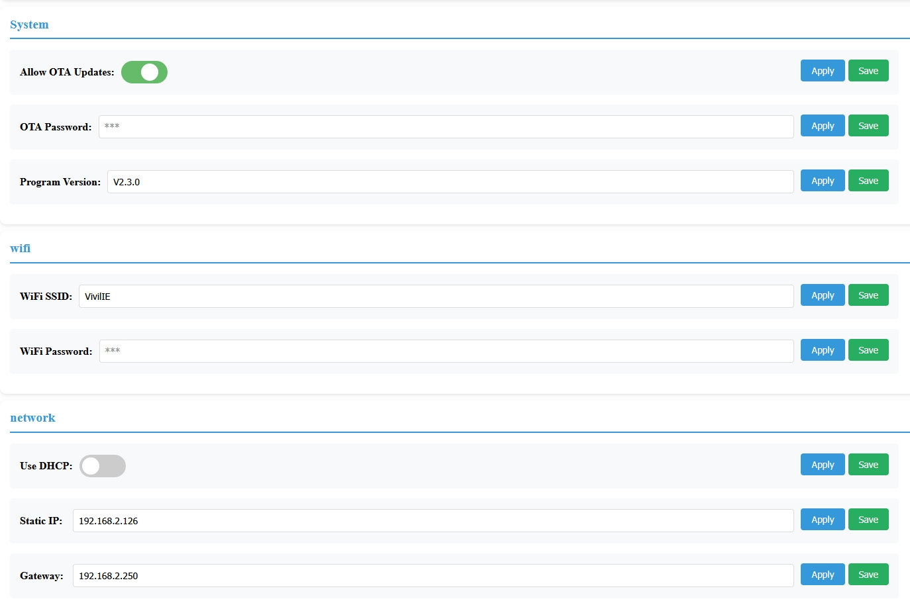
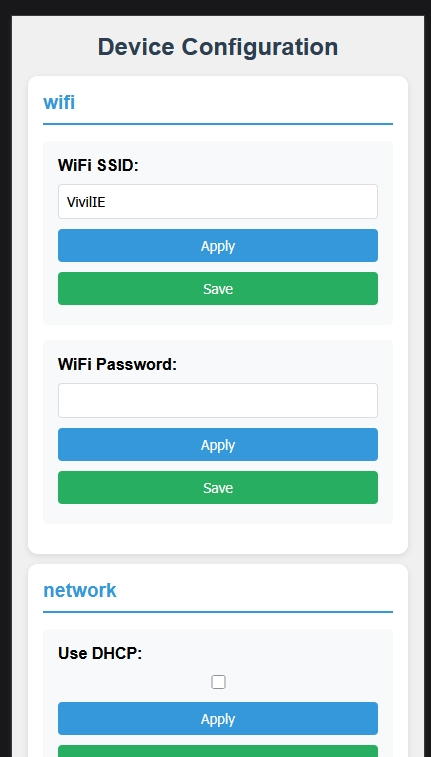
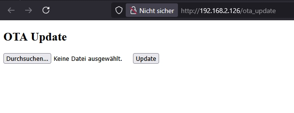

# ConfigurationsManager for ESP32

> Version 2.0.1

[]

[]
[]


## Overview

The ConfigurationsManager is a project designed to manage and store configuration settings for ESP32-based applications. It provides an easy-to-use interface for saving, retrieving, and updating configuration parameters, ensuring persistent storage and efficient management.

## Note: This is a C++17 Project

```ini
[env:nodemcu-32s]
platform = espressif32
board = nodemcu-32s
framework = arduino
monitor_speed = 115200
upload_port = COM[3]
build_unflags = -std=gnu++11
build_flags =
    -Wno-deprecated-declarations
    -std=gnu++17
lib_deps = bblanchon/ArduinoJson@^7.4.1

[platformio]
description = ESP32 C++17 Project for managing settings
```

## Features

- 📦 Non-Volatile Storage (NVS) integration (esp preferences)
- 🌐 Responsive Web Configuration Interface
- 🔒 Password masking & secret handling
- 🔄 Automatic WiFi reconnect
- 📡 AP Mode fallback

## Requirements

- ESP32 development board
- Arduino IDE or PlatformIO
- add _build_flags = -std=gnu++17_ and _build_unflags = -std=gnu++11_ to your platformio.ini file

## Screenshots







## examples

```cpp
#include <Arduino.h>
#include "ConfigManager.h"
#include <WebServer.h>

//##########################################################################
// main declarations
ConfigManagerClass cfg; // Create an instance of ConfigManager before using it in structures etc.
ConfigManagerClass::LogCallback ConfigManagerClass::logger = nullptr; // Initialize the logger to nullptr

WebServer server(80);

//##########################################################################
//declaration Examples:
// basic example
Config<int> updateInterval("interval", "main", "Update Interval (seconds)", 30);
Config<bool> useTempOffset("UTC", "Temp", "Use Temp-Correction offset", true);
Config<float>  TempCorrectionOffset("TCO", "Temp","Temperature Correction", 0.1);

//##########################################################################

// declaration as an struct
struct WiFi_Settings
{
    Config<String> wifiSsid;
    Config<String> wifiPassword;
    Config<bool> useDhcp;
    Config<String> staticIp;
    Config<String> gateway;
    Config<String> subnet;

    //todo: add static-IP settings
    WiFi_Settings() :

                    wifiSsid("ssid", "wifi", "WiFi SSID", "MyWiFi"),
                    wifiPassword("password", "wifi", "WiFi Password", "secretpass", true, true),
                    useDhcp("dhcp", "network", "Use DHCP", false),
                    staticIp("sIP", "network", "Static IP", "192.168.2.126"),
                    subnet("subnet", "network", "Subnet-Mask", "255.255.255.0"),
                    gateway("GW", "network", "Gateway", "192.168.2.250")

    {
        cfg.addSetting(&wifiSsid);
        cfg.addSetting(&wifiPassword);
        cfg.addSetting(&useDhcp);
        cfg.addSetting(&staticIp);
        cfg.addSetting(&gateway);
        cfg.addSetting(&subnet);
    }
};

WiFi_Settings wifiSettings; //instance of wifiSettings

//##########################################################################


//##########################################################################

//Usage in setup():

void setup()
{

 Serial.begin(115200);
 // ConfigManagerClass::setLogger(cbMyConfigLogger); //as extern callback function
 ConfigManagerClass::setLogger([](const char *msg){
            Serial.print("[my-Section]: ");
            Serial.println(msg);
        }); // or as lambda function

  // Register settings basic usage
  cfg.addSetting(&updateInterval);
  cfg.addSetting(&useTempOffset);
  cfg.addSetting(&TempCorrectionOffset);

  cfg.loadAll(); // Load all settings from NVS (should be done after adding all settings)
  cfg.checkSettingsForErrors(); // Optional: Check for errors in settings (prints to logger if there are issues)

  mqttSettings.updateTopics(); // Ensure topics are initialized based on current Publish_Topic value

  updateInterval.set(15); // Change a setting value
  cfg.saveAll(); // Save all settings to NVS

  Serial.println(cfg.toJSON(false)); // Print all settings as JSON (pretty print)


  // Start WiFi and Web Server
  if (wifiSettings.wifiSsid.get().length() == 0) {
          Serial.printf("⚠️ SETUP: SSID is empty! [%s]\n", wifiSettings.wifiSsid.get().c_str());
          cfg.startAccessPoint();
  }

  if (WiFi.getMode() == WIFI_AP) {
      Serial.printf("🖥️  AP Mode! \n");
      return; // Skip webserver setup in AP mode
  }

  if (wifiSettings.useDhcp.get()) {
      Serial.println("DHCP enabled");
      cfg.startWebServer(wifiSettings.wifiSsid.get(), wifiSettings.wifiPassword.get());
  } else {
      Serial.println("DHCP disabled");
      // cfg.startWebServer("192.168.2.126", "255.255.255.0", "192.168.0.250" , wifiSettings.wifiSsid.get(), 
      cfg.startWebServer(wifiSettings.wifiSsid.get(), wifiSettings.wifiPassword.get());wifiSettings.wifiPassword.get());
  }

  delay(1500);

  if (WiFi.status() == WL_CONNECTED) {
      cfg.setupOTA("Ota-esp32-device", generalSettings.otaPassword.get().c_str());
  }
  Serial.printf("🖥️ Webserver running at: %s\n", WiFi.localIP().toString().c_str());
}


void loop() {

  if (WiFi.getMode() == WIFI_AP) {
    Serial.printf("🖥️ Run in AP Mode!\n");
    cfg.handleClient();
    return false; // Skip other in AP mode
  }

  if (WiFi.status() != WL_CONNECTED){ 
    cfg.reconnectWifi();
    delay(1000);
  }

  cfg.handleClient(); // Handle web server clients
  cfg.handleOTA(); //ota is not available in AP mode
  delay(1000);
}

```


## Installation

```bash
# PlatformIO
pio pkg install --library "vitaly.ruhl/ESP32ConfigManager"
```

1. Include the ConfigurationsManager library in your project.

```cpp
#include <ConfigManager.h>

Config<String> wifiSSID("ssid", "network", "MyWiFi");
Config<String> wifiPass("password", "network", "", true, true);

void setup() {
  ConfigManager.addSetting(&wifiSSID);
  ConfigManager.addSetting(&wifiPass);
  configManager.saveAll();
  ConfigManager.startWebServer();
}

// see the main.cpp for more information
```

### use platform.io enviroments to upload over usb or ota

```sh
#See platformio.ini for details

platformio run -e usb -t upload # use this to upload via usb

# Or via ota:
pio run -e ota -t upload

#or:
#pio run --target upload --upload-port <ESP32_IP_ADDRESS>
pio run -e ota -t upload --upload-port 192.168.2.126

#or over the Webinterface use http://192.168.2.126/ota_update
# before you need to compile like this: pio run -e usb

#sometimes you get an guru-meditation error, if you upload,
#try this:
pio run -e usb -t erase #this will delete all flash data on your esp32!
pio run -e usb -t clean

```

## Version History

- **1.0.0**: Initial release with basic features.
- **1.0.2**: make an library
- **1.1.0**: add Structure example, bugfix, add delete settings functions
- **1.1.1**: forgot to change library version in library.json
- **1.1.2**: Bugfix: add forgotten function applyAll() in html
- **1.2.0**: add logging function as callback for flexible logging
- **1.2.1**: bugfix in logger over more, then one headder using, add dnsserver option for static ip.
- **1.2.2**: bugfix remove throwing errors, becaus it let esp restart without showing the error message.
- **2.0.0**: Add OTA support, add new example for OTA, add new example for WiFiManager with OTA. Add PrettyName for web interface
- **2.0.1**: bugfixing, and add an additional site to transfer firmware over webinterface
- **2.0.2**: bugfixing, prevent an buffer overflow on to long category and / or (idk) have an white spaces in key or category.
              I has an mistake in TempCorrectionOffset("TCO","Temperature Correction", "Temp", 0.1) instead of TempCorrectionOffset("TCO", "Temp","Temperature Correction", 0.1) --> buffer overflow and guru meditation error
- **2.1.0**: add callback for value changes

## ToDo

- HTTPS Support
- add optional pretty category names (or Automatic on more then 12 chars)
- add optional selective show on webinterface (eg. if dhcp is disabled -> show ip, gw, sn, dns settings
- add optional order number for settings to show on webinterface
- add optional order number for categories to show on webinterface
- add optional description for settings to show on webinterface as tooltip)
- add optional shor password in cleartext to show on webinterface, and or console
- add reset to default for single settings
- show boolean checkbox as switch and not in the middle if big size of screen
- add configurable OTA route
- add configurable OTA password for webinterface
- i18n Support
- make c++ V11 support (i hope for contribution, because i have not enough c++ knowledge for make it typ-safe)
- add test for new functions
- add more examples

## known Issues

- **Save all** button works only, if you saved value ones over single save-button
- **Save all** repair pssword change to "" if pres save all with empty password field
