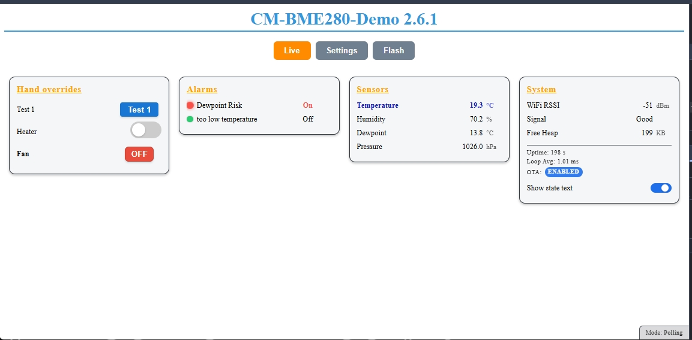
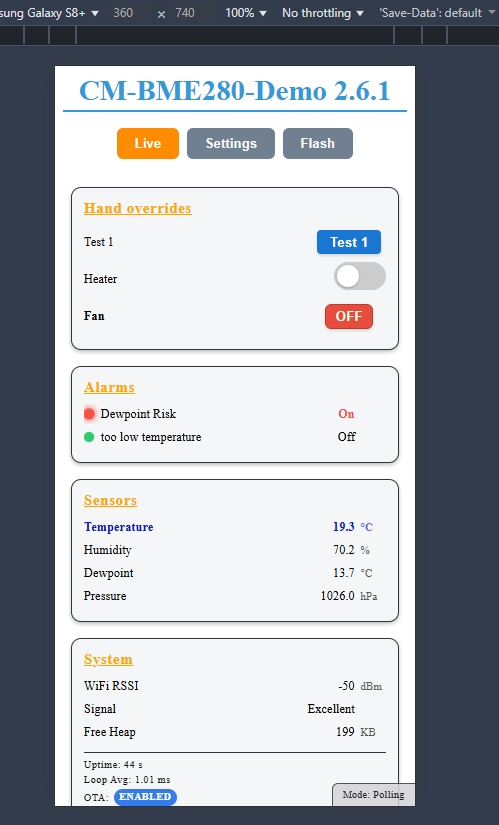
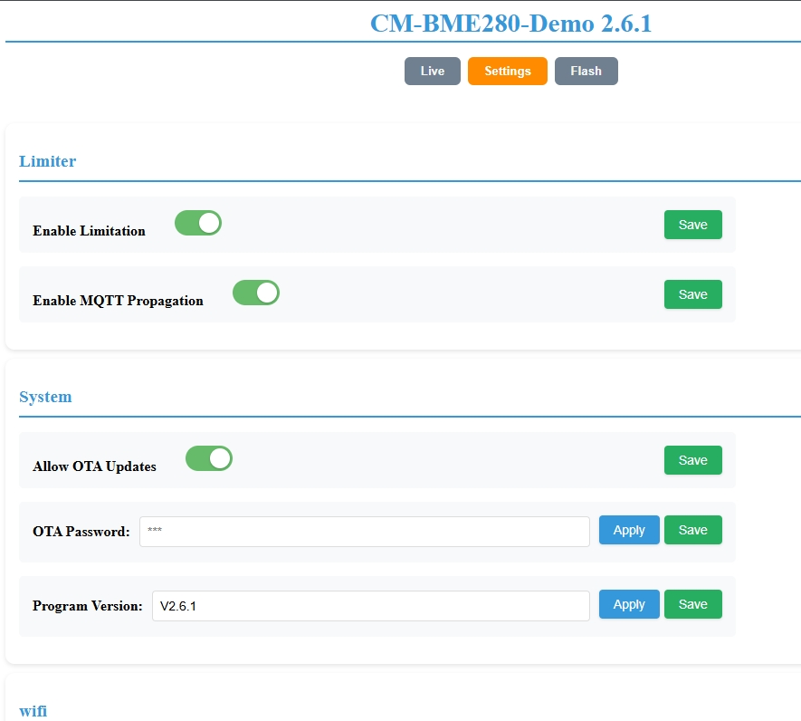
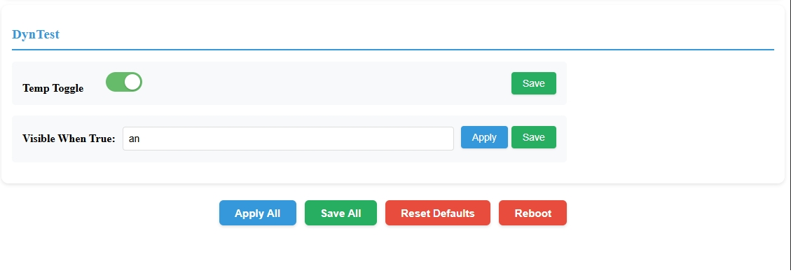
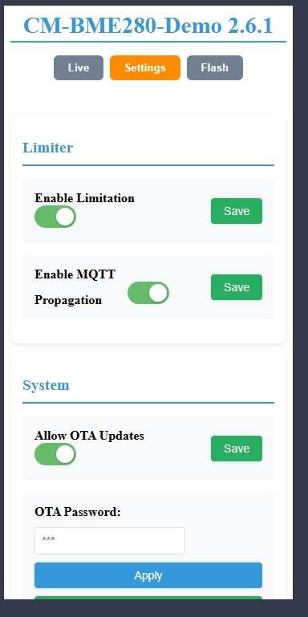
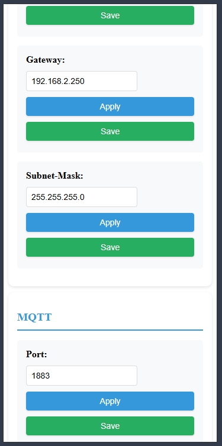
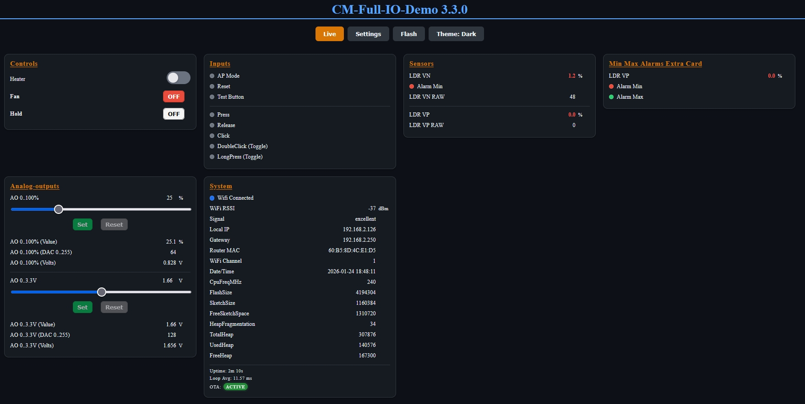

# ConfigurationsManager for ESP32

> Version 3.3.0

## Why this exists

Most ESP32 projects start the same way:
you need a web server, persistent configuration storage, WiFi handling, OTA updates, and some way to inspect or control runtime values.

Individually, none of these problems are difficult.
But together they quickly turn into repetitive boilerplate that distracts from the actual purpose of your project.

This library exists to solve that once.

It provides a structured, type-safe way to define settings, persist them, expose them through a responsive Web UI, and interact with live runtime data — without forcing you to design yet another custom web server or configuration layer.

You focus on your application logic.
The infrastructure is already there.

## Overview

> Focus on your project logic — not on web servers, storage, or configuration plumbing.

ConfigurationsManager is a C++17 helper library and example firmware for ESP32 projects that need persistent configuration, a web-based UI, and live runtime visibility — without building custom infrastructure from scratch. It focuses on:

- Type‑safe templated `Config<T>` wrappers
- Central registration + bulk load/save functions
- Optional pretty display names and pretty category names (decouple storage key from UI)
- Automatic key truncation safety (category + key <= 15 chars total in NVS) with friendly UI name preserved
- Dynamic conditional visibility (`showIf` lambdas)
- Callbacks on value change
- OTA update integration
- Static or DHCP WiFi startup helpers (multiple overloads)
- Optional logging module (Serial/GUI/MQTT outputs)

## Note: C++17 Required

>This project requires `-std=gnu++17` (or newer).
>It intentionally uses modern C++ features such as inline variables, structured bindings, and `std::function` to keep the API expressive and type-safe.

## Features

### Core
- Non-Volatile Storage (NVS / Preferences)
- Type-safe `Config<T>` wrappers
- Central registration + bulk load/save

### Web UI & Runtime
- Responsive WebUI (embedded in flash)
- Live runtime values (`/runtime.json`, WebSocket)
- Per-setting styling & theming

### Device & Connectivity
- WiFi helpers (DHCP / static / AP fallback)
- OTA firmware upload via WebUI
- Optional MQTT module (PubSubClient-based)

### Logging
- Optional logging module (Serial, GUI log tab, MQTT output)

### Extensibility
- Conditional visibility (`showIf`)
- Callbacks on value change
- Core settings templates & IOManager module

## Documentation Index

| Topic                                     | File                                                   |
| ----------------------------------------- | ------------------------------------------------------ |
| Getting Started (minimal pattern)         | [docs/GETTING_STARTED.md](docs/GETTING_STARTED.md)     |
| WiFi (DHCP/static/AP/reconnect)           | [docs/WIFI.md](docs/WIFI.md)                           |
| Settings & OptionGroup                    | [docs/SETTINGS.md](docs/SETTINGS.md)                   |
| Runtime Providers & Alarms                | [docs/RUNTIME.md](docs/RUNTIME.md)                     |
| Logging                                  | [docs/LOGGING.md](docs/LOGGING.md)                     |
| IOManager: Digital Inputs                 | [docs/IO-DigitalInputs.md](docs/IO-DigitalInputs.md)   |
| IOManager: Digital Outputs                | [docs/IO-DigitalOutputs.md](docs/IO-DigitalOutputs.md) |
| IOManager: Analog Inputs                  | [docs/IO-AnalogInputs.md](docs/IO-AnalogInputs.md)     |
| IOManager: Analog Outputs                 | [docs/IO-AnalogOutputs.md](docs/IO-AnalogOutputs.md)   |
| OTA + Web UI flashing                     | [docs/OTA.md](docs/OTA.md)                             |
| Security Notes (password transport)       | [docs/SECURITY.md](docs/SECURITY.md)                   |
| Styling (per-field metadata)              | [docs/STYLING.md](docs/STYLING.md)                     |
| Theming (global CSS + disabling metadata) | [docs/THEMING.md](docs/THEMING.md)                     |
| Troubleshooting                           | [docs/TROUBLESHOOTING.md](docs/TROUBLESHOOTING.md)     |
| MQTT Module                               | [docs/MQTT.md](docs/MQTT.md)                           |
| Changelog                                 | [docs/CHANGELOG.md](docs/CHANGELOG.md)                 |
| Build Options (v3 change note)            | [docs/FEATURE_FLAGS.md](docs/FEATURE_FLAGS.md)         |

## Requirements

- **ESP32 development board** (ESP32, ESP32-S2, ESP32-S3, ESP32-C3)
- **PlatformIO** (preferred) or Arduino IDE (Arduino IDE not tested!)
- **Node.js 18.0.0+** (only if you want to rebuild the WebUI)
- **Python 3.8+** (optional; only used by legacy tooling)
- Add `-std=gnu++17` (and remove default gnu++11) in `platformio.ini`

## Installation

```bash
# PlatformIO
pio pkg install --library "vitaly.ruhl/ESP32ConfigManager"
```

## Quick Start Guide

If you want to get up and running fast, use one of the example projects in `examples/`.

### 1) Build / upload an example (recommended)

Each folder in `examples/` is a standalone PlatformIO project.

Build:

```sh
pio run -d examples/minimal -e usb
```

Upload:

```sh
pio run -d examples/minimal -e usb -t upload --upload-port COM5
```

### 2) Use as a library in your own project

Minimal `platformio.ini` snippet:

```ini
[env:usb]
platform = espressif32
board = your_board
framework = arduino

build_unflags = -std=gnu++11
build_flags =
    -Wno-deprecated-declarations
    -std=gnu++17
    ; Optional logging switches:
    ; -DCM_ENABLE_LOGGING=1
    ; -DCM_ENABLE_VERBOSE_LOGGING=0

lib_deps =
    vitaly.ruhl/ESP32 Configuration Manager@^3.3.0
```

For a complete minimal firmware pattern, see `docs/GETTING_STARTED.md`.

## Notes (v3)

- v3.0.0+ ships the embedded WebUI directly in the library (`src/html_content.*`).

## Security Notice

The Web UI and API are served over plain HTTP.
If you need transport security, provide it externally (trusted WiFi only, VPN, or a TLS reverse proxy that terminates HTTPS).

Details: see `docs/SECURITY.md`.

## Examples

> Example files live in the `examples/` directory:

Each example is a standalone PlatformIO project:

- [examples/minimal](examples/minimal) - minimal demo
- [examples/BME280-Temp-Sensor](examples/BME280-Temp-Sensor) - BME280 temp sensor
- [examples/Full-GUI-Demo](examples/Full-GUI-Demo) - full GUI demo
- [examples/Full-IO-Demo](examples/Full-IO-Demo) - IOManager demo (incl. core settings templates)
- [examples/ChipInfo](examples/ChipInfo) - device/chip information demo
- [examples/SolarInverterLimiter](examples/SolarInverterLimiter) - real-world larger project using this library

Build an example:

```bash
pio run -d examples/BME280-Temp-Sensor -e usb
```

Upload (USB example):

```bash
pio run -d examples/BME280-Temp-Sensor -e usb -t upload --upload-port COM5
```

If you use a fork / local clone of this repo, you can build and upload any example the same way (the `-d examples/<name>` flag points PlatformIO to the example project directory).

If you want to consume the library as a local dependency in your own project, you can also use a local `lib_deps = file://../ConfigurationsManager` setup (see the note about recursive local installs below).

Note (Windows): these example projects set `[platformio] build_dir` and `libdeps_dir` outside the repo to prevent recursive local installs when using `lib_deps = file://../..`.

Tips:

- Avoid `lib_extra_dirs = ../..` for the workspace library; it can cause cross-example compilation issues.
- Some examples include a pre-build helper script `tools/pio_force_local_lib_refresh.py` to force PlatformIO to refresh the local `file://../..` library copy automatically (disable via `CM_PIO_NO_LIB_REFRESH=1`).
- If you see `UnicodeEncodeError: 'charmap' codec can't encode character ...` on Windows, see `docs/TROUBLESHOOTING.md`.

More:

- Getting started (full minimal pattern): `docs/GETTING_STARTED.md`
- WiFi behavior / best practices: `docs/WIFI.md`
- OTA and Web UI flashing: `docs/OTA.md`
- Troubleshooting: `docs/TROUBLESHOOTING.md`

## Screenshots

### The embedded Web UI automatically adapts to desktop and mobile devices.

>New in v3.3.0
> 
>

> Example on Monitor HD
> 
> Example on mobile
> 
> Settings on HD
> 
> 
> Settings on mobile
> 
> 
> Darkmode
> 

## Version History

Moved to [docs/CHANGELOG.md](docs/CHANGELOG.md).

## ToDo / Issues

- [see TODO.md in docs folder](docs/TODO.md)

<br>
<br>


## Donate

<table align="center" width="100%" border="0" bgcolor:=#3f3f3f>
<tr align="center">
<td align="center">  
if you prefer a one-time donation

[](https://paypal.me/FamilieRuhl)

</td>

<td align="center">  
Become a patron, by simply clicking on this button (**very appreciated!**):

[](https://www.patreon.com/join/6555448/checkout?ru=undefined)

</td>
</tr>
</table>

<br>
<br>

---

## Copyright

`2024-2026 (c)Vitaly Ruhl`

License: GNU General Public License v3.0