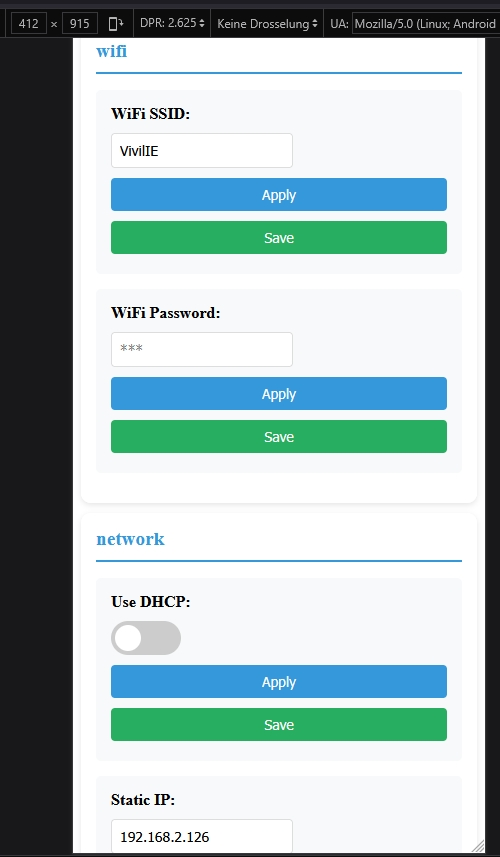

# ConfigurationsManager for ESP32

> Version 2.4.3 (2025.09.30)

[]
[](https://registry.platformio.org/libraries/vitaly.ruhl/ESP32%20Configuration%20Manager)

## Overview

The ConfigurationsManager is a C++17 helper library & example firmware for managing persistent configuration values on ESP32 (NVS / Preferences) and exposing them via a responsive Vue 3 single‑page web UI and OTA update endpoint. It focuses on:

- Type‑safe templated `Config<T>` wrappers
- Central registration + bulk load/save functions
- Optional pretty display names and pretty category names (decouple storage key from UI)
- Automatic key truncation safety (category + key <= 15 chars total in NVS) with friendly UI name preserved
- Dynamic conditional visibility (`showIf` lambdas)
- Callbacks on value change
- OTA update integration
- Static or DHCP WiFi startup helpers (multiple overloads)

## Note: This is a C++17 Project

```ini
[env:nodemcu-32s]
platform = espressif32
board = nodemcu-32s
framework = arduino
monitor_speed = 115200
upload_port = COM[3]
build_unflags = -std=gnu++11
build_flags =
    -Wno-deprecated-declarations
    -std=gnu++17
lib_deps = bblanchon/ArduinoJson@^7.4.1

[platformio]
description = ESP32 C++17 Project for managing settings
```

## Features

- 📦 Non-Volatile Storage (NVS) integration (ESP Preferences)
- 🌐 Vue 3 responsive web configuration interface (embedded in flash)
- 🎯 Declarative config registration with a `ConfigOptions<T>` aggregate
- 🪄 Dynamic visibility of settings via `showIf` lambda (e.g. hide static IP fields while DHCP enabled)
- 🔒 Password masking & selective exposure
- 🛎️ Per‑setting callbacks (`cb` or `setCallback`) on value changes
- 📡 AP Mode fallback / captive portal style entry
- 🚀 OTA firmware upload endpoint
- ⚡ Flash firmware directly from the web UI (password-protected HTTP OTA)
- 🔴 Live runtime values (`/runtime.json`)
- 🔁 WebSocket push channel (`/ws`) (frontend auto‑fallback to polling if socket not connected)
- Manager API: `addRuntimeProvider({...})`, `enableWebSocketPush(intervalMs)`, `pushRuntimeNow()`, optional `setCustomLivePayloadBuilder()`
- 🧩 Boilerplate reduction helpers: `OptionGroup` factory + `showIfTrue()/showIfFalse()` visibility helpers (since 2.4.3)

>To see how i use it in my project, check out my GitHub (most features are used in this project):
>[https://github.com/vitalyruhl/SolarInverterLimiter](https://github.com/vitalyruhl/SolarInverterLimiter)  

### Live Runtime Values & Alarm System since 2.4.x


The library can expose non‑persistent runtime / sensor values to the web UI and (optionally) over a WebSocket channel for low‑latency updates.

Key building blocks:

1. **Runtime Providers** (`addRuntimeProvider`)

Provide a lambda that fills a nested JSON object under its name each time a payload is built.

```cpp
cfg.addRuntimeProvider({
  .name = "sensors",
  .fill = [](JsonObject &o){
      o["temp"] = currentTemp;
      o["hum"]  = currentHumidity;
      o["dew"]  = dewPoint;
  }
});
```

1. **Runtime Field Metadata**

Define how each field should be rendered (precision, unit) or evaluated (warn/alarm thresholds, boolean semantics) by the frontend.

```cpp
cfg.defineRuntimeFieldThresholds("sensors", "temp", "Temperature", "°C", 1,
    /*warnMin*/ 1.0f, /*warnMax*/ 30.0f,
    /*alarmMin*/ 0.0f, /*alarmMax*/ 32.0f,
    true,true,true,true
);
cfg.defineRuntimeField("sensors", "dew", "Dewpoint", "°C", 1); // plain (no thresholds)
```

Frontend consumes `/runtime_meta.json` → groups, units, precision, thresholds.

1. **Boolean Runtime Fields**

```cpp
// Plain (no alarm styling)
cfg.defineRuntimeBool("flags", "tempToggle", "Temp Toggle", false);
// Alarm boolean (blink red when true, green when safe)
cfg.defineRuntimeBool("alarms", "dewpoint_risk", "Dewpoint Risk", true);
```

Metadata adds: `isBool`, `hasAlarm`, `alarmWhenTrue` (omitted if false). Frontend derives styling:

- Alarm bool safe → solid green dot  
- Alarm bool active → blinking red  
- Plain bool true → green, false → white outline

1. **Cross‑Field Alarms** (`defineRuntimeAlarm`)

Allows conditions spanning multiple providers/fields. Each alarm has:

- `name`  
- `condition(JsonObject &root)` → returns bool  
- `onEnter()` callback (fires once when condition becomes true)  
- `onExit()` callback (fires once when condition falls back to false)

```cpp
cfg.defineRuntimeAlarm(
  "dewpoint_risk",
  [](const JsonObject &root){
      if(!root.containsKey("sensors")) return false;
      auto sensors = root["sensors"].as<JsonObject>();
      if(!sensors.containsKey("temp") || !sensors.containsKey("dew")) return false;
      float t = sensors["temp"].as<float>();
      float d = sensors["dew"].as<float>();
      return (t - d) <= 5.0f; // risk window (≤5°C above dew point)
  },
  [](){ Serial.println("[ALARM] Dewpoint proximity risk ENTER"); },
  [](){ Serial.println("[ALARM] Dewpoint proximity risk EXIT"); }
);
```

Active alarm states are added to `/runtime.json` under an `alarms` object:

```json
{
  "uptime": 123456,
  "sensors": { "temp": 21.3, "hum": 44.8, "dew": 10.2 },
  "alarms": { "dewpoint_risk": true }
}
```

1. **Relay / Actuator Integration Example**

A temperature minimum alarm driving a heater relay with hysteresis:

```cpp
#define RELAY_HEATER_PIN 25
pinMode(RELAY_HEATER_PIN, OUTPUT);
digitalWrite(RELAY_HEATER_PIN, LOW); // assume LOW = off

cfg.defineRuntimeAlarm(
  "temp_low",
  [](const JsonObject &root){
      static bool active = false; // hysteresis state
      if(!root.containsKey("sensors")) return false;
      auto sensors = root["sensors"].as<JsonObject>();
      if(!sensors.containsKey("temp")) return false;
      float t = sensors["temp"].as<float>();
      if(active) active = (t < 0.5f); // release above +0.5°C
      else       active = (t < 0.0f); // enter below 0.0°C
      return active;
  },
  [](){ Serial.println("[ALARM] temp_low ENTER -> heater ON"); digitalWrite(RELAY_HEATER_PIN, HIGH); },
  [](){ Serial.println("[ALARM] temp_low EXIT -> heater OFF"); digitalWrite(RELAY_HEATER_PIN, LOW); }
);
```

1. **Evaluating Alarms**

Call periodically in `loop()` (a lightweight internal merge of runtime JSON + condition checks):

```cpp
cfg.handleRuntimeAlarms();
```

You can adjust frequency (e.g. every 1–3s) depending on responsiveness needed.

1. **WebSocket Push**

No compile-time flags needed; Async server + WebSocket are part of the default build.

```cpp
cfg.enableWebSocketPush(2000);   // broadcast every 2s
cfg.handleWebsocketPush();       // call in loop()
```

Frontend strategy: try WebSocket first → if not available, poll `/runtime.json` (2s default in UI).

1. **Custom Payload (Optional)**

Override the generated payload:

```cpp
cfg.setCustomLivePayloadBuilder([](){
    DynamicJsonDocument d(256);
    d["uptime"] = millis();
    d["heap"] = ESP.getFreeHeap();
    String out; serializeJson(d, out); return out;
});
```

1. **Frontend Rendering Logic (Summary)**

- Uses `/runtime_meta.json` for grouping, units, thresholds, boolean semantics.  
- `/runtime.json` supplies live values + `alarms` map.  
- Alarm booleans blink slower (1.6s) for readability; numeric threshold violations use color + blink.

1. **Memory / Footprint Notes**

- Runtime doc buffers kept modest (1–2 KB per build) – adjust if you add many providers/fields.  
- Keep provider `fill` lambdas fast; avoid blocking IO inside them.

### Minimal End‑to‑End Example (Live + Alarm)

```cpp
// Setup (after WiFi):
cfg.addRuntimeProvider({ .name="sys", .fill = [](JsonObject &o){ o["heap"] = ESP.getFreeHeap(); }});
cfg.defineRuntimeField("sys", "heap", "Free Heap", "B", 0);
cfg.addRuntimeProvider({ .name="env", .fill = [](JsonObject &o){ o["temp"] = readTempSensor(); }});
cfg.defineRuntimeFieldThresholds("env", "temp", "Temperature", "°C", 1,
   5.0f, 30.0f,   // warn range
   0.0f, 40.0f,   // alarm range
   true,true,true,true);
cfg.defineRuntimeAlarm("too_cold",
   [](const JsonObject &root){ return root["env"]["temp"].as<float>() < 0.0f; },
   [](){ Serial.println("cold ENTER"); },
   [](){ Serial.println("cold EXIT"); }
);
cfg.enableWebSocketPush(1500);
```

#### New in 2.4.2 (Unreleased): Runtime String Fields, Dividers & Ordering

You can enrich the Live view with informational text lines and visual separators and control ordering.

```cpp
// String value (dynamic: taken from provider runtime JSON key "fw")
cfg.defineRuntimeString("system", "fw", "Firmware", CONFIGMANAGER_VERSION);

// Static string (not looked up in /runtime.json)
cfg.defineRuntimeString("system", "build", "Build", "2025-09-29", /*order*/ 5);

// Divider at top of sensors group
cfg.defineRuntimeDivider("sensors", "Environment", 0);

// Ordered numeric fields
cfg.defineRuntimeField("sensors", "temp", "Temperature", "°C", 1, /*order*/ 10);
cfg.defineRuntimeField("sensors", "hum", "Humidity", "%", 1, /*order*/ 20);

// Provider (card) ordering
cfg.setRuntimeProviderOrder("system", 1);
cfg.setRuntimeProviderOrder("sensors", 5);
```

Metadata additions in `/runtime_meta.json`:

| Key | Meaning |
|-----|---------|
| `isString` | Render as plain text value (no unit/precision formatting) |
| `isDivider` | Render a horizontal rule with label |
| `staticValue` | Value to show even if absent from `/runtime.json` |
| `order` | Sort hint (lower first). Default 100 |

Older frontends ignore these keys gracefully.

---

## Requirements

- ESP32 development board
- Arduino IDE or PlatformIO
- add _build_flags = -std=gnu++17_ and _build_unflags = -std=gnu++11_ to your platformio.ini file

## Screenshots

>Example on Monitor HD


>Example on mobile



>OTA Update over web-interface


## Flash Firmware via Web UI

The embedded single-page app now exposes a `Flash` action beside the `Settings` tab so you can push new firmware without leaving the browser.

1. Enable `Allow OTA Updates` under **System** and set an `OTA Password` (leave empty to allow unauthenticated uploads).
2. Click **Flash** and pick the compiled `.bin` (or `.bin.gz`) image produced by PlatformIO / Arduino.
3. Enter the OTA password when prompted. The SPA sends it as the `X-OTA-PASSWORD` header so it never ends up inside the firmware payload.
4. Watch the toast notifications for progress. On success the device reboots automatically; the UI keeps polling until it comes back online.

The backend remains fully asynchronous (`ESPAsyncWebServer`)—the new `/ota_update` handler streams chunks into the `Update` API while still performing password checks. HTTP uploads are rejected when OTA is disabled, the password is missing/incorrect, or the upload fails integrity checks.

## Examples

Example files live in the `examples/` directory:

- `main.cpp_example_min` – Minimal WiFi + runtime provider + WebSocket push + OTA.
- `main.cpp_example_bme280` – Extended sensor + thresholds + cross‑field alarms.
- `main.cpp_publish` – Auto-generated stub used when building the `publish` environment.

Below is the minimal pattern (using `ESPAsyncWebServer`).

```cpp
#include <Arduino.h>
#include "ConfigManager.h"
#include <AsyncTCP.h>
#include <ESPAsyncWebServer.h>
AsyncWebServer server(80);

ConfigManagerClass cfg;
ConfigManagerClass::LogCallback ConfigManagerClass::logger = nullptr;

// Basic setting using new aggregate initialization (ConfigOptions<T>)
Config<int> updateInterval(ConfigOptions<int>{
    .keyName = "interval",
    .category = "main",
    .defaultValue = 30,
    .prettyName = "Update Interval (seconds)"
});

// Dynamic visibility example: show static IP fields only if DHCP disabled
struct WiFi_Settings {
  Config<String> wifiSsid;
  Config<String> wifiPassword;
  Config<bool>   useDhcp;
  Config<String> staticIp;
  Config<String> gateway;
  Config<String> subnet;

  WiFi_Settings() :
    wifiSsid(ConfigOptions<String>{ .keyName="ssid", .category="wifi", .defaultValue="MyWiFi", .prettyName="WiFi SSID", .prettyCat="Network Settings" }),
    wifiPassword(ConfigOptions<String>{ .keyName="password", .category="wifi", .defaultValue="secretpass", .prettyName="WiFi Password", .prettyCat="Network Settings", .showInWeb=true, .isPassword=true }),
    useDhcp(ConfigOptions<bool>{ .keyName="dhcp", .category="network", .defaultValue=false, .prettyName="Use DHCP", .prettyCat="Network Settings" }),
    staticIp(ConfigOptions<String>{ .keyName="sIP", .category="network", .defaultValue="192.168.2.126", .prettyName="Static IP", .prettyCat="Network Settings", .showIf=[this](){ return !this->useDhcp.get(); } }),
    gateway(ConfigOptions<String>{ .keyName="GW", .category="network", .defaultValue="192.168.2.250", .prettyName="Gateway", .prettyCat="Network Settings", .showIf=[this](){ return !this->useDhcp.get(); } }),
    subnet(ConfigOptions<String>{ .keyName="subnet", .category="network", .defaultValue="255.255.255.0", .prettyName="Subnet-Mask", .prettyCat="Network Settings", .showIf=[this](){ return !this->useDhcp.get(); } })
  {
    cfg.addSetting(&wifiSsid);
    cfg.addSetting(&wifiPassword);
    cfg.addSetting(&useDhcp);
    cfg.addSetting(&staticIp);
    cfg.addSetting(&gateway);
    cfg.addSetting(&subnet);
  }
};

WiFi_Settings wifiSettings;

void setup() {
  Serial.begin(115200);
  ConfigManagerClass::setLogger([](const char* msg){ Serial.print("[CFG] "); Serial.println(msg); });

  cfg.addSetting(&updateInterval);
  cfg.loadAll();
  cfg.checkSettingsForErrors();

  // Optional update
  updateInterval.set(15);
  cfg.saveAll();

  if (wifiSettings.wifiSsid.get().isEmpty()) {
    cfg.startAccessPoint();
  }

  if (WiFi.getMode() != WIFI_AP) {
    if (wifiSettings.useDhcp.get()) {
      cfg.startWebServer(wifiSettings.wifiSsid.get(), wifiSettings.wifiPassword.get());
    } else {
      // Explicit static (IP, Gateway, Mask)
      cfg.startWebServer(wifiSettings.staticIp.get(), wifiSettings.gateway.get(), wifiSettings.subnet.get(), wifiSettings.wifiSsid.get(), wifiSettings.wifiPassword.get());
      // Or full explicit including DNS:
      // cfg.startWebServer(wifiSettings.staticIp.get(), wifiSettings.gateway.get(), wifiSettings.subnet.get(), String("8.8.8.8"), wifiSettings.wifiSsid.get(), wifiSettings.wifiPassword.get());
    }
  }

  if (WiFi.status() == WL_CONNECTED) {
    cfg.setupOTA("Ota-esp32-device", "ota1234");
    cfg.enableWebSocketPush(2000); // periodic push (interval ms)
  }
}

void loop() {
  cfg.handleClient();
  cfg.handleWebsocketPush();
  cfg.handleOTA();
  delay(250);
}
```


### Dynamic Visibility (showIf) Pattern

The `showIf` member of `ConfigOptions<T>` is a `std::function<bool()>`. It is evaluated on every JSON generation for the web UI (after each apply/save). Keep it lightweight (simple flag checks) to avoid blocking the loop. Example:

```cpp
Config<bool> enableAdvanced(ConfigOptions<bool>{
  .keyName = "adv",
  .category = "sys",
  .defaultValue = false,
  .prettyName = "Enable Advanced"
});
Config<int> hiddenUnlessEnabled(ConfigOptions<int>{
  .keyName = "hnum",
  .category = "sys",
  .defaultValue = 42,
  .prettyName = "Hidden Number",
  .showIf = [](){ return enableAdvanced.get(); }
});
```

### Reducing Boilerplate with OptionGroup (since 2.4.3)

When many settings share the same category & pretty category, you can use `OptionGroup` to avoid repetition.

Before:

```cpp
Config<String> wifiSsid(ConfigOptions<String>{
  .keyName="ssid", .category="wifi", .defaultValue="MyWiFi",
  .prettyName="WiFi SSID", .prettyCat="Network Settings"
});
Config<String> wifiPassword(ConfigOptions<String>{
  .keyName="password", .category="wifi", .defaultValue="secretpass",
  .prettyName="WiFi Password", .prettyCat="Network Settings",
  .showInWeb = true, .isPassword = true
});
```

After (factory pattern):

```cpp
constexpr OptionGroup WIFI_GROUP{"wifi", "Network Settings"};

Config<String> wifiSsid( WIFI_GROUP.opt<String>(
  "ssid", String("MyWiFi"), "WiFi SSID") );

Config<String> wifiPassword( WIFI_GROUP.opt<String>(
  "password", String("secretpass"), "WiFi Password", true, true) );
```

The template `opt<T>(key, defaultValue, prettyName, showInWeb, isPassword, cb, showIf)` returns a fully populated `ConfigOptions<T>`.

### Visibility Helper Functions

To replace repeating lambdas like `[this](){ return !this->useDhcp.get(); }`, two helper factories are available:

```cpp
inline std::function<bool()> showIfTrue (const Config<bool>& flag);
inline std::function<bool()> showIfFalse(const Config<bool>& flag);
```

Usage inside a settings struct:

```cpp
struct WiFi_Settings {
  Config<bool> useDhcp;
  Config<String> staticIp;
  Config<String> gateway;
  Config<String> subnet;

  WiFi_Settings() :
    useDhcp(    WIFI_GROUP.opt<bool>("dhcp", false, "Use DHCP") ),
    staticIp(   WIFI_GROUP.opt<String>("sIP",    String("192.168.2.126"), "Static IP",    true, false, nullptr, showIfFalse(useDhcp) ) ),
    gateway(    WIFI_GROUP.opt<String>("GW",     String("192.168.2.250"), "Gateway",      true, false, nullptr, showIfFalse(useDhcp) ) ),
    subnet(     WIFI_GROUP.opt<String>("subnet", String("255.255.255.0"), "Subnet-Mask",  true, false, nullptr, showIfFalse(useDhcp) ) )
  { /* addSetting(...) */ }
};
```

Benefits:

- Less visual noise → easier to scan core semantics
- Lower risk of copy/paste mistakes (e.g., forgetting to invert a condition)
- Consistent semantics across different settings groups

### Migration Tips

1. Introduce one `constexpr OptionGroup` per logical category (e.g. `wifi`, `network`, `MQTT`).
2. Gradually refactor: old style (`ConfigOptions{...}`) and new factory style can coexist.
3. For dynamic visibility tied to a boolean `Config<bool>` field, prefer `showIfTrue/False(flag)`.
4. Keep complex logic (multi-field dependencies) in a dedicated lambda or helper—helpers are intended only for simple flag toggles.
5. If you need a callback (`cb`) and a C++ lambda, prefer setting `.cb` for plain function pointer or call `setCallback()` after construction.

---

### Static IP Helper Overloads

Overloads now available:

1. `startWebServer(ssid, password)` → DHCP
2. `startWebServer(ip, mask, ssid, password)` → Derives gateway (.1) + DNS 8.8.8.8
3. `startWebServer(ip, gateway, mask, ssid, password)` → Explicit gateway (DNS 8.8.8.8)
4. `startWebServer(ip, gateway, mask, dns, ssid, password)` → Fully explicit

### Key Length & Truncation Safety

Internal storage key format: `<category>_<keyName>` truncated to 15 chars to satisfy ESP32 NVS limits. Provide human friendly `.prettyName` / `.prettyCat` for UI text. Avoid relying on raw key for user output.

### Password / Secret Fields

Set `.isPassword = true` to mask in UI. The backend stores the real value; UI obscures it and only sends new value when field changed.

## Installation

```bash
# PlatformIO
pio pkg install --library "vitaly.ruhl/ESP32ConfigManager"
```

### Async Build & Live Values

The project now always uses the Async stack; no `env:async` or `-DUSE_ASYNC_WEBSERVER` define is needed.

If the WebSocket isn't connected the frontend transparently polls `/runtime.json`.

### Runtime Providers & WebSocket API

Register a provider:

```cpp
cfg.addRuntimeProvider({
  .name = "sensors",
  .fill = [](JsonObject& o){
      o["temp"] = readTemp();
      o["hum"]  = readHum();
  }
});
```

Enable WebSocket push:

```cpp
cfg.enableWebSocketPush(1500); // push every 1.5s
```

In your loop (async build):

```cpp
cfg.handleWebsocketPush(); // handles interval + broadcast
```

Provide custom payload instead of auto runtime JSON:

```cpp
cfg.setCustomLivePayloadBuilder([](){
    DynamicJsonDocument d(256);
    d["uptime"] = millis();
    d["heap"] = ESP.getFreeHeap();
    String out; serializeJson(d, out); return out;
});
```

Immediate manual push:

```cpp
cfg.pushRuntimeNow();
```

1. Include the ConfigurationsManager library in your project.

```cpp
#include <ConfigManager.h>

Config<String> wifiSSID("ssid", "network", "MyWiFi");
Config<String> wifiPass("password", "network", "", true, true);

void setup() {
  ConfigManager.addSetting(&wifiSSID);
  ConfigManager.addSetting(&wifiPass);
  configManager.saveAll();
  ConfigManager.startWebServer();
}

// see the main.cpp for more information
```

### PlatformIO environments (usb / ota / publish)

```sh
#See platformio.ini for details

pio run -e usb -t upload # upload via usb

# Or via ota:
pio run -e ota -t upload

#or:
#pio run --target upload --upload-port <ESP32_IP_ADDRESS>
pio run -e ota -t upload --upload-port 192.168.2.126

# Or over the Web UI: http://<device-ip>/ota_update (after first USB upload)

# Minimal publish (stub) build (example code excluded):
pio run -e publish

#sometimes you get an guru-meditation error, if you upload,
#try this:
pio run -e usb -t erase #this will delete all flash data on your esp32!
pio run -e usb -t clean

```

## Version History

- **1.0.0**: Initial release with basic features.
- **1.0.2**: make an library
- **1.1.0**: add Structure example, bugfix, add delete settings functions
- **1.1.1**: forgot to change library version in library.json
- **1.1.2**: Bugfix: add forgotten function applyAll() in html
- **1.2.0**: add logging function as callback for flexible logging
- **1.2.1**: bugfix in logger over more, then one headder using, add dnsserver option for static ip.
- **1.2.2**: bugfix remove throwing errors, becaus it let esp restart without showing the error message.
- **2.0.0**: Add OTA support, add new example for OTA, add new example for WiFiManager with OTA. Add PrettyName for web interface
- **2.0.1**: bugfixing, and add an additional site to transfer firmware over webinterface
- **2.0.2**: bugfixing, prevent an buffer overflow on to long category and / or (idk) have an white spaces in key or category.
              I has an mistake in TempCorrectionOffset("TCO","Temperature Correction", "Temp", 0.1) instead of TempCorrectionOffset("TCO", "Temp","Temperature Correction", 0.1) --> buffer overflow and guru meditation error
- **2.1.0**: add callback for value changes
- **2.2.0**: add optional pretty category names, convert static HTML to Vue3 project for better maintainability
- **2.3.0**: introduce `ConfigOptions<T>` aggregate initialization (breaking style update) + dynamic `showIf` visibility + improved front-end auto-refresh
- **2.3.1**: added multiple `startWebServer` static IP overloads, refactored connection logic, suppressed noisy NOT_FOUND NVS messages when keys absent, updated README
- **2.4.0**: added live values over json and websocket (async build only)
  - Added runtime metadata (`/runtime_meta.json`) for units / precision / thresholds / boolean semantics
  - Added boolean alarm styling & safe/alarm states
  - Added cross‑field alarm registry (`defineRuntimeAlarm`)
  - Added relay control example via alarm callbacks
- **2.4.1**: removed compile-time feature flags (async/WebSocket/runtime always available); added publish stub environment
- **2.4.2**: added runtime string fields, dividers, and ordering; minor frontend tweaks
- **2.5.0**: added OptionGroup factory (`OptionGroup::opt<T>()`) + visibility helpers `showIfTrue/showIfFalse` to reduce boilerplate; documentation updates, Add OTA firmware upload via web UI with password protection(configurable over init and web UI)

## ToDo

- HTTPS Support (original async lib not support https 😒 )
- add optional order number for categories to show on webinterface
- add optional description for settings to show on webinterface as tooltip
- add optional show-password flag to show password on webinterface, and or console
- add reset to default for single settings
- i18n Support
- make c++ V11 support

## known Issues

- prettyCat is not working for consolidate categories. On webinterface will be only the category name of the first setting in this category shown.
- if a category has only one setting and this setting is hidden by showIf, the category will be shown as empty.
