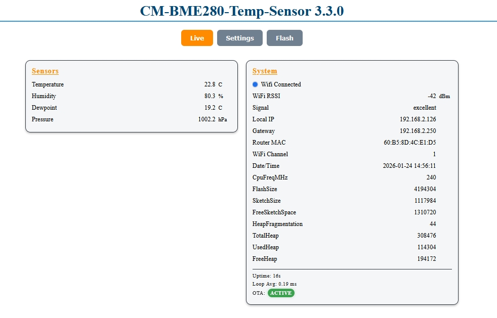
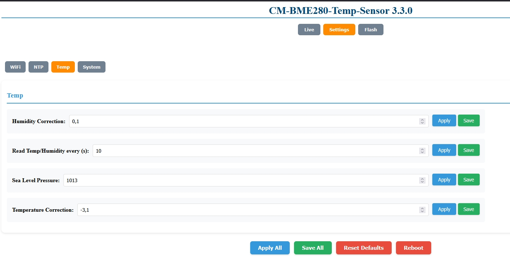

# CM BME280 Temp Sensor Demo (BME280-Temp-Sensor)

This example shows a simple temperature/humidity/pressure setup based on a BME280 sensor and the ConfigurationsManager Web UI.

## What it demonstrates

- Core settings templates: WiFi + System + NTP via `cm::CoreSettings`
- Settings-driven WiFi startup via `ConfigManager.startWebServer()` (DHCP/static/AP fallback)
- WiFi lifecycle hooks via `cm::CoreWiFiServices` (OTA init + NTP sync ticker)
- Runtime provider + Runtime meta for live sensor values in the Web UI
- Periodic sensor reads via `Ticker`

## Hardware

- ESP32 (e.g. NodeMCU-32S)
- BME280 (I2C)

Default pins (see `src/main.cpp`):

- SDA: GPIO21
- SCL: GPIO22

## How to run

From the repo root:

```bash
pio run -d examples/BME280-Temp-Sensor -e usb
pio run -d examples/BME280-Temp-Sensor -e usb -t upload
```

## First start / AP mode

If no SSID is configured yet, the device starts in AP mode.
Open the printed AP URL from Serial (usually `http://192.168.4.1`) and configure WiFi via the Web UI.

## Screenshots




