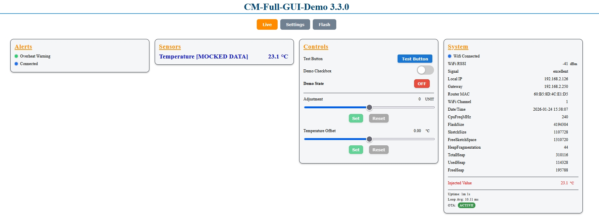
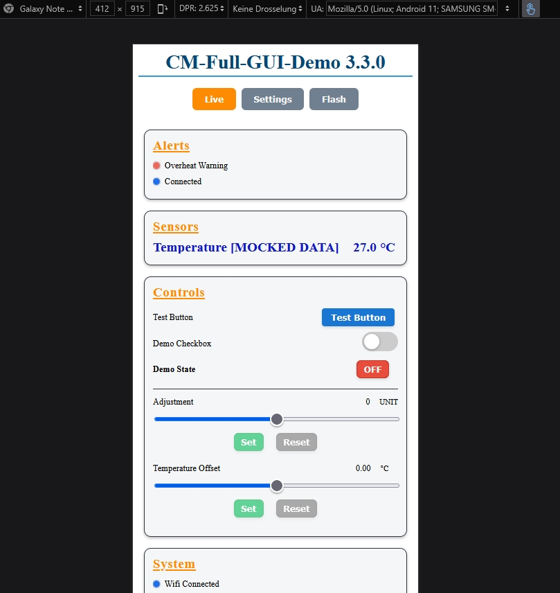
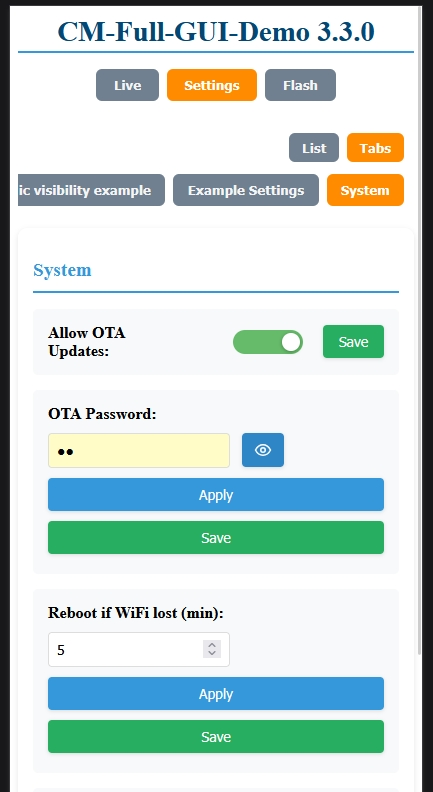

# CM Full GUI Demo (Full-GUI-Demo)

This example focuses on the ConfigurationsManager Web UI and runtime widgets.
It does **not** require any external sensors.

## What it demonstrates

- Core settings templates: WiFi + System + NTP via `cm::CoreSettings`
- Settings-driven startup via `ConfigManager.startWebServer()` (DHCP/static/AP fallback)
- WiFi hook lifecycle via `cm::CoreWiFiServices` (OTA init + NTP sync ticker)
- Runtime providers + runtime meta (cards, dividers, bool fields, sliders, buttons)
- Global CSS override via `ConfigManager.setCustomCss()`

## Mocked sensor data

The "Sensors" card shows **[MOCKED DATA]**: a randomized temperature value updated every 3 seconds.

## How to run

From the repo root:

```bash
pio run -d examples/Full-GUI-Demo -e usb
pio run -d examples/Full-GUI-Demo -e usb -t upload
```

## First start / AP mode

If no SSID is configured yet, the device starts in AP mode.
Open the printed AP URL from Serial (usually `http://192.168.4.1`) and configure WiFi via the Web UI.

## Screenshots

### Desktop



### Mobile



### Settings


