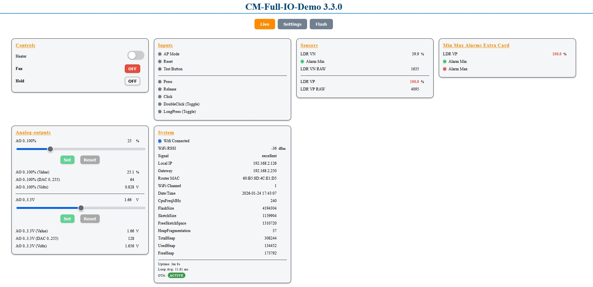
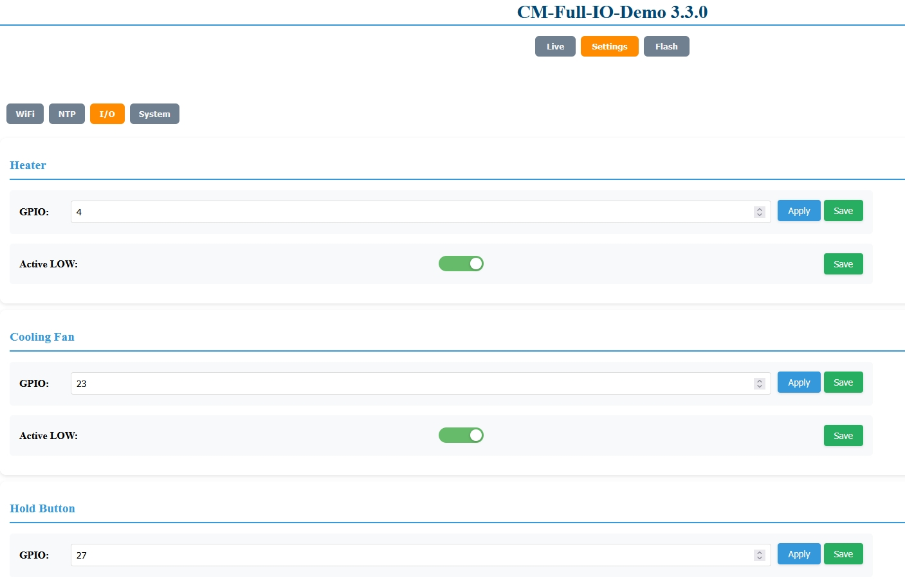
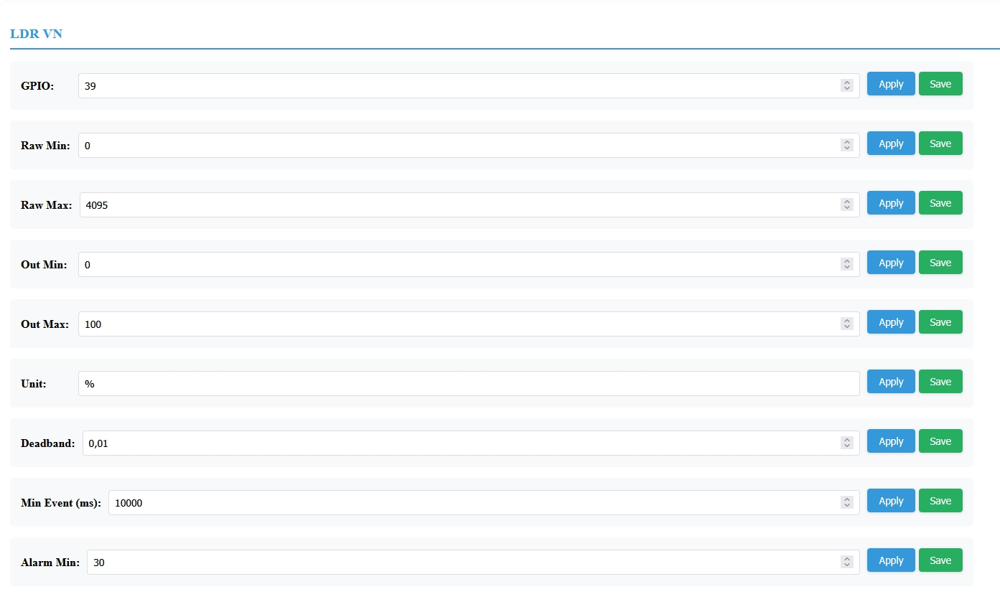
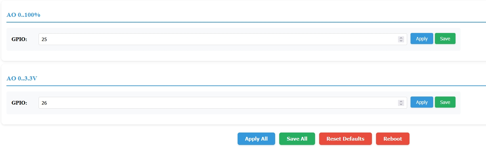

# Full IO Demo (Full-IO-Demo)

This example demonstrates IO-related features (via `IOManager`) plus a rich runtime GUI.

The IO wiring is split into definition, settings placement, and runtime layout so you can see how the refactor-friendly builder APIs apply in a real sketch. Each IO category now gets its own `I/O` card and live page, and the runtime controls sit on dedicated Live tabs (`controls`, `inputs`, `sensors`, `analog-outputs`, your alarm card, etc.).

If you want a GUI-only showcase without IO-related parts, see `examples/Full-GUI-Demo`.

## Screenshots

