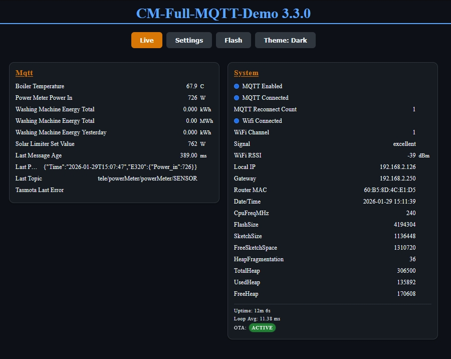
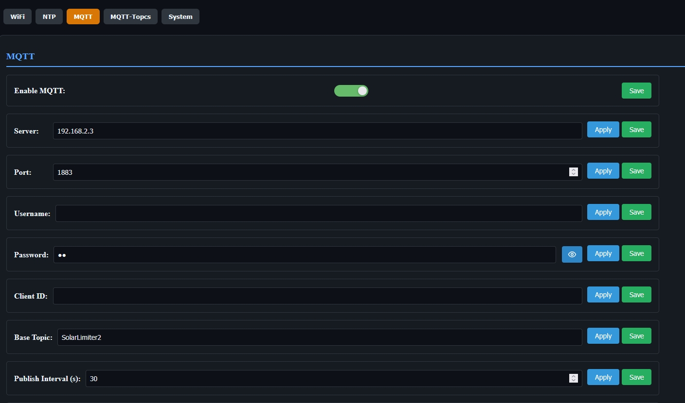
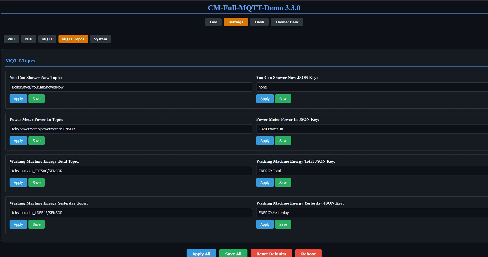

# CM Full MQTT Demo (Full-MQTT-Demo)

This example focuses on the optional MQTT module (`cm::MQTTManager`) and its integration into the ConfigurationsManager Web UI.

## What it demonstrates

- Core settings templates: WiFi + System + NTP via `cm::CoreSettings`
- Settings-driven startup via `ConfigManager.startWebServer()` (DHCP/static/AP fallback)
- MQTT module usage via explicit include: `#include "mqtt/MQTTManager.h"`
- MQTT connection state + last message visible in the Runtime view

## Dependency

This example adds:

- `knolleary/PubSubClient@^2.8`

## How to run

From the repo root:

```bash
pio run -d examples/Full-MQTT-Demo -e usb
pio run -d examples/Full-MQTT-Demo -e usb -t upload
```

## First start / AP mode

If no SSID is configured yet, the device starts in AP mode.
Open the printed AP URL from Serial (usually `http://192.168.4.1`) and configure WiFi via the Web UI.

## MQTT configuration

After WiFi is configured:

- Set `MQTT: Enable` = true
- Configure `MQTT: Server` + `MQTT: Port`
- Optional: `MQTT: Username` + `MQTT: Password`
- Optional: `MQTT: Subscribe Topic` (example: `cm/demo/#`)

Then watch the `MQTT` runtime card for status updates.

## Screenshots

 
 
 


